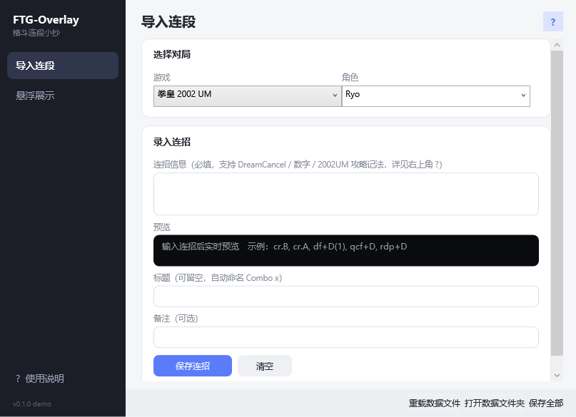

# FTG-Overlay

> 格斗游戏连段小抄 —— 把你记录的连段自动转成图形化记法，置顶悬浮在游戏画面上。


练连段时总要在游戏和攻略网页之间来回切屏？FTG-Overlay 把街机厅贴在屏幕旁的「出招表小抄」搬进电脑：把网上抄来的连段文本粘贴进管理器，它会自动解析并渲染成**方向箭头 + 彩色拳脚按钮**的图形化小抄，**置顶悬浮**在游戏画面上——鼠标穿透、不挡操作，一行一条。

## 截图

| 悬浮小抄（游戏中） | 管理器 |
|---|---|
|  |  |

## 功能

**连段小抄（悬浮窗）**
- 黑底半透明面板，**一行一整条连段**；透明度 / 大小可调，位置自动记忆
- 窗口置顶 + **鼠标穿透**，搓招不受影响
- 面板右侧**小锁头图标**：任何状态下点击即可切换「锁定 / 可拖动」
- 两套配色：简约深色（默认）/ 霓虹街机

**管理器**
- 「导入」页：按**游戏 + 角色**录入连段，粘贴即解析、实时预览；标题留空自动命名 Combo x
- 「展示」页：连招显示开关（勾选才上悬浮窗）、编辑 / 删除、悬浮窗样式设置
- 数据存本地 JSON（记事本可编辑），修改自动保存

**安全设计红线**：不读游戏内存、不注入进程、不模拟按键；离线可用、无遥测。

## 支持的记法

以下写法可**自由混用**（示例为 KOF）：

| 风格 | 示例 |
|---|---|
| DreamCancel 字母风 | `cr.B, cr.A, df+D(1), qcf+D, rdp+D` |
| 数字（numpad）风 | `2B, 2A, 3D(1), 26D, 421D` |
| 2002UM 攻略风 | `c5C xx 3D xx 63214B+C xx 236D•D, 421D` |

常用符号与缩写：

- 姿态：`cr.` 蹲 · `st.` 站 · `cl.` / `c` 近立 · `j.` 跳 · 数字 `5` = 中立站立
- 指令：`qcf` = `236` · `qcb` = `214` · `dp` = `623`/`626` · `rdp` = `421` · `hcb` = `63214` · `hcf` = `4126`/`41236`
- 组合：`xx` / `xxx` 取消 · `>` 连携 · `•` 同一必杀的派生键 · `(N)` 帧数 / 段数标注 · `B+C` 双按钮

无法识别的记号会**原样显示并标黄**，绝不静默丢弃。

## 快速开始

1. 到 [Releases](https://github.com/wizacro/FTG-Overlay/releases) 下载 `FTG-Overlay-demo-vX.X.X.zip`
2. 解压后双击 `FTG-Overlay-demo.exe`（无需安装，首次启动会自动弹出使用说明）
3. 管理器「导入」页粘贴连段 → 保存 → 「展示」页勾选显示 → 打开悬浮窗

> 游戏内请使用**无边框全屏**或窗口模式——独占全屏下悬浮窗会被游戏画面覆盖。
> 全局热键仅有 `Ctrl+Alt+Q`（退出程序），其余操作都在管理器内完成。

## 从源码构建

零第三方依赖——Windows 10/11 自带的 .NET Framework C# 编译器即可：

```bat
git clone https://github.com/wizacro/FTG-Overlay.git
cd FTG-Overlay\src-demo
build.bat
```

## 文档

- [需求文档](docs/02-需求文档.md)（含历轮确认记录）
- [任务计划](docs/03-任务计划.md)（里程碑与验收标准）
- [调研与参考](docs/01-调研与参考.md)（GitHub 同类项目对比）
- [设计稿与实拍](docs/design/)

## Roadmap

- [ ] 连招搜索与标签过滤
- [ ] 更多主题皮肤（可切换）
- [ ] 记法互转（导出其他格式）
- [ ] SF6 / MK11 记法档案
- [ ] 托盘图标

## License

[MIT](LICENSE)
